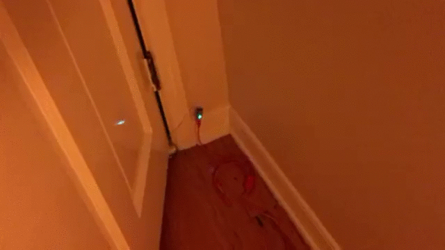

Halloween Fun Times.
===

Demo video
---

Materials
---

- [Particle/Spark core](https://www.particle.io/)
- [Phillips Hue bulb](http://www2.meethue.com/) for your portch light
- Bluetooth speaker that will be hidden on your portch
- [Magnetic door reed switch](http://sfe.io/p13247)
- A computer on which you have python 2.6+

WAT‽
---

I get **a LOT** of trick-or-treaters, easily more than 100. Basically,
this is a flask app that will strobe my portch light red, and
play a blood-curdling scream when I open my screen door.

A `POST` to a machine on my local network running `app.py` is triggered
from a Particle Core via `TCPClient` whenever the magnetic door switch
is activated. The flask app handles light-flickering and `Scream.mp3`
playing.

There is also a simple control page (`index.html`) so that I can easily
toggle the light flickering and scream playing. I don't want to emotionally
scar any tiny kids.

I could also maybe do something to turn on a GoPro...maybe...hadn't thought
of it until just now...
